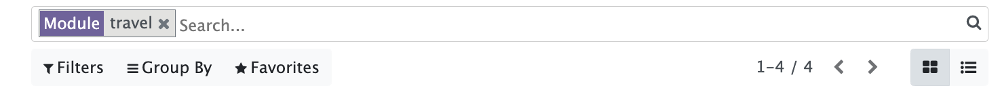

Master pw: rmh8-ecv6-2amz

# Installatieinstructies

In deze installatieinstructies zetten we een Odoo installatie op op de 'odoo' databank.

1. Start de installatie op http://localhost:8069. Gebruik odoo als database naam.

1. Voeg een app toe, bv Sales. Dit kan even duren. Na de installatie kom je op de 'Discuss' app.

1. Ga naar de Settings app. Scroll helemaal naar beneden op de tab 'General Settings' en klik op 'Activate the developer mode'.

    

1. Ga naar de 'Apps' app. 

    

1. Klik op 'Update Apps List' om de lijst van custom modules te refreshen.

    

1. In de zoekbalk, verwijder de 'Apps' filter en typ 'Travel'.

    

1. Installeer de Travel module.

    

Klaar!

## Travel management

Deze module is een voorbeeld van een custom addon voor Odoo.

De custom_addons folder wordt gemount als folder in /mnt/extra-addons. Deze folder wordt door Odoo opgepikt.

Om de addon te installeren, enable developer mode in Odoo. Het kan zijn dat je eerst een app moet installeren, alvorens de instellingen in Odoo beschikbaar worden.

## Mail/smtp

De docker compose file bevat een mailserver, die luistert op poort 1025 voor smtp verkeer en de webinterface is beschikbaar op poort 1080.
